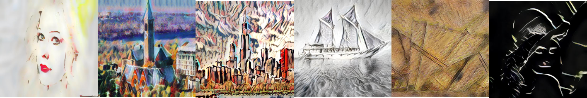

# pytorch-AdaIN

Implementations are based on https://github.com/naoto0804/pytorch-AdaIN, unofficial pytorch implementation of Arbitrary Style Transfer in Real-time with Adaptive Instance Normalization [Huang+, ICCV2017]



## Requirements
Please install requirements by `pip install -r requirements.txt`

- Python 3.5+
- PyTorch 0.4+
- TorchVision
- Pillow

(optional, for training)
- tqdm
- TensorboardX

## Usage

### Test
Use `--content` and `--style` to provide the respective path to the content and style image.
```
CUDA_VISIBLE_DEVICES=<gpu_id> python test.py --content input/content/cornell.jpg --style input/style/woman_with_hat_matisse.jpg
```

You can also run the code on directories of content and style images using `--content_dir` and `--style_dir`. It will save every possible combination of content and styles to the output directory.
```
CUDA_VISIBLE_DEVICES=<gpu_id> python test.py --content_dir input/content --style_dir input/style
```

This is an example of mixing four styles by specifying `--style` and `--style_interpolation_weights` option.
```
CUDA_VISIBLE_DEVICES=<gpu_id> python test.py --content input/content/avril.jpg --style input/style/picasso_self_portrait.jpg,input/style/impronte_d_artista.jpg,input/style/trial.jpg,input/style/antimonocromatismo.jpg --style_interpolation_weights 1,1,1,1 --content_size 512 --style_size 512 --crop
```

Some other options:
* `--content_size`: New (minimum) size for the content image. Keeping the original size if set to 0.
* `--style_size`: New (minimum) size for the content image. Keeping the original size if set to 0.
* `--alpha`: Adjust the degree of stylization. It should be a value between 0.0 and 1.0 (default).
* `--preserve_color`: Preserve the color of the content image.


### Train
Use `--content_dir` and `--style_dir` to provide the respective directory to the content and style images.
Pretrained models in `models/` are trained with [MSCOCO images](http://mscoco.org/dataset/#download) and [Wikiart images](https://www.kaggle.com/c/painter-by-numbers).
```
CUDA_VISIBLE_DEVICES=<gpu_id> python train.py --content_dir <content_dir> --style_dir <style_dir>
```

For more details and parameters, please refer to --help option.

## References
- [1]: X. Huang and S. Belongie. "Arbitrary Style Transfer in Real-time with Adaptive Instance Normalization.", in ICCV, 2017.
- [2]: [Original implementation in Torch](https://github.com/xunhuang1995/AdaIN-style)
